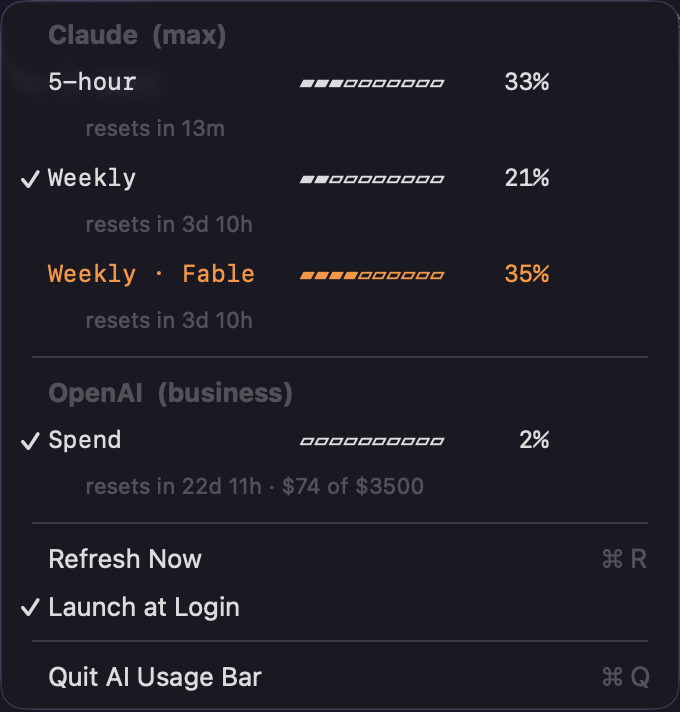

# AI Usage Bar

A native macOS menu-bar app that shows your **current subscription usage** for
**Claude** (Pro/Max) and **OpenAI/ChatGPT** (Plus/Pro) side by side — the same
rolling-window percentages you'd see in Claude Code's `/usage` and Codex CLI's
`/status`, always visible in the menu bar.

A compact title sits in the menu bar —

<div align="center" style="text-align:center">
  
</div>

— and clicking it drops down the full per-window breakdown for both providers:

<div align="center" style="text-align:center">
  
</div>

<sub>`✓` marks the window shown in the menu-bar title (per provider) · <b>orange</b> marks the
window currently binding your usage (the API's <code>is_active</code> flag) ·
OpenAI here is a <b>business</b> plan, so it shows a monthly <b>Spend</b> cap
(<code>$74 of $3500</code>) instead of Plus/Pro's rolling 5-hour + Weekly windows.</sub>

Each usage row is clickable: click one to pin it as that provider's menu-bar
percentage; click it again to revert to auto (highest window). A `✓` always
marks the window currently shown in the menu bar — the pinned row, or the
auto-selected one when unpinned — and each provider's selection is independent.
The window currently binding your usage (the API's `is_active` flag) is drawn in
**orange**.

## How it works

No API keys required — it reuses the OAuth tokens the official CLIs already store,
and calls the same undocumented usage endpoints they use:

| Provider | Endpoint | Token source |
|----------|----------|--------------|
| Claude   | `GET api.anthropic.com/api/oauth/usage` | Keychain `Claude Code-credentials`, fallback `~/.claude/.credentials.json` |
| OpenAI   | `GET chatgpt.com/backend-api/wham/usage` | `~/.codex/auth.json` |

It re-reads the tokens on every poll, so it rides on the CLIs keeping them fresh.
Poll interval defaults to **120s**; last-good values are kept on network/429 errors.

For **Claude**, usage is read from the endpoint's structured `limits[]` array, which
exposes the 5-hour session window, the all-model weekly cap, **and per-model weekly
caps** (e.g. **Fable**) via each entry's `scope.model.display_name`. Any additional
model-scoped caps your plan has appear automatically — nothing is hard-coded to Fable.

**Choosing what the menu-bar shows:** the compact percentage defaults to the *highest*
window across everything. Click any usage row in the dropdown to pin that window instead;
click the pinned row again to go back to auto. The choice is saved. When a provider lacks
the pinned window (OpenAI has no "Fable" cap), it falls back to that provider's highest.

## Requirements

- **macOS 13 or later**
- A **Swift toolchain** — Xcode 15+ or the standalone toolchain (`swift --version`).
  If missing: `xcode-select --install`.
- Signed in at least once with the CLIs so the OAuth tokens exist:
  - `claude` — authenticate (Claude Pro/Max)
  - `codex` — authenticate (ChatGPT Plus/Pro/Business)
- Optional: [`just`](https://github.com/casey/just) for the task recipes — `brew install just`

## Install

From the repository root (the folder containing `Package.swift`):

```bash
just install          # build (release) + bundle + ad-hoc sign + copy to /Applications
open "/Applications/AI Usage Bar.app"
```

Without `just`, the equivalent is:

```bash
./build.sh
cp -R "build/AI Usage Bar.app" /Applications/
open "/Applications/AI Usage Bar.app"
```

The app appears in the **menu bar** (no Dock icon).

- **First run:** macOS prompts *"AI Usage Bar wants to use information stored in
  Claude Code-credentials"* → click **Always Allow** (that's the Claude Keychain
  token). Allow any login-keychain prompt too.
- **Start at boot:** click the menu-bar item → **Launch at Login**.

Because you build it locally, Gatekeeper does **not** block it (no quarantine flag),
so `open` just works. The ad-hoc signature is fine for personal use but is **not
notarized** — don't redistribute the `.app` to other Macs as-is.

### Updating

```bash
just restart          # rebuild + relaunch the running copy
just install          # refresh the /Applications copy
```

### Uninstalling

Turn off **Launch at Login** in the menu first, then:

```bash
just uninstall        # or: rm -rf "/Applications/AI Usage Bar.app"
```

### Quick sanity check (no GUI)

Verify credentials + endpoints straight from the terminal:

```bash
just probe            # or: swift run AIUsageBar --probe
just dump             # raw HTTP status + response body, for debugging shapes
```

`probe` prints each provider's plan, windows, and reset countdowns — the fastest
way to confirm the token/endpoint plumbing works before worrying about the UI.

## Troubleshooting

- **First run shows a Keychain prompt** ("AI Usage Bar wants to use information
  stored in Claude Code-credentials"). Click **Always Allow**. This is expected —
  the Claude token lives in the login Keychain.
- **Claude shows "Not signed in"** — run `claude` once and authenticate. If your
  token is Keychain-only and the prompt was denied, re-grant access in
  *Keychain Access → Claude Code-credentials → Access Control*.
- **OpenAI shows "Not signed in"** — run `codex` once and authenticate so
  `~/.codex/auth.json` exists.
- **OpenAI plan shape** — Plus/Pro report rolling **5-hour + Weekly** windows;
  **Business/enterprise** plans return `rate_limit: null` and instead expose a
  monthly **Spend** cap (shown as a "Spend" row with `$used of $limit`). If OpenAI
  shows "No data", run `just dump` and check which shape your account returns.
- **"Re-auth needed" (401)** — the stored token expired; open the relevant CLI to
  refresh it. (Automatic OAuth refresh isn't implemented in v1.)
- **"Rate limited" (429)** — the usage endpoints throttle aggressive polling;
  the app keeps the last-good values. Leave the interval at 120s or higher.
- **Launch at Login item missing/ineffective** — this needs the bundled, signed
  `.app` from `build.sh`, not a bare `swift run` binary.

## Project layout

```
Package.swift                     SwiftPM executable (macOS 13+)
Info.plist                        LSUIElement agent + bundle id
build.sh                          build + bundle + ad-hoc sign
Sources/AIUsageBar/
  main.swift                      entry point (+ --probe mode)
  AppDelegate.swift               NSStatusItem, menu, rendering
  UsageStore.swift                provider registry + polling loop
  Formatting.swift                title / bar / countdown helpers
  Models.swift                    UsageWindow, ProviderUsage, errors
  LoginItem.swift                 SMAppService launch-at-login
  Providers/
    Provider.swift                protocol + shared HTTP helpers
    AnthropicProvider.swift       Claude usage fetch + parse
    OpenAIProvider.swift          OpenAI usage fetch + parse
  Credentials/
    ClaudeCredentials.swift       Keychain + file token reader
    CodexCredentials.swift        auth.json (+ JWT account-id) reader
```

## Extending

Adding a provider is: implement `UsageProvider`, return a `ProviderUsage`, and add
it to the array in `AppDelegate`'s `UsageStore(...)` init. A future **API/$-spend
mode** (Anthropic Admin key, OpenAI usage API) would slot in as additional
providers alongside the subscription ones.
